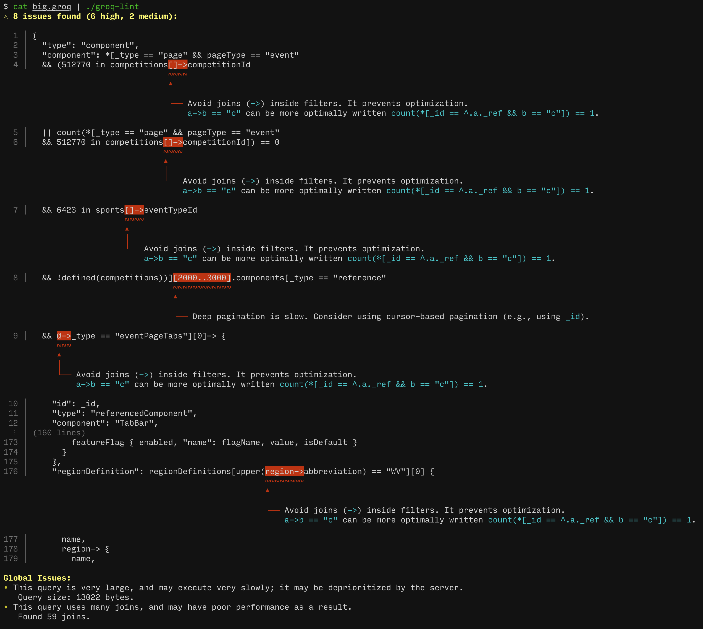

# groq-lint

A linter for [GROQ](https://www.sanity.io/docs/groq) queries that detects performance issues and anti-patterns.



## Installation

```bash
cargo install --path .
```

## Usage

### Command Line

```bash
# Lint a query
groq-lint '*[_type == "post"][author->name == "John"]'

# Show context lines around issues
groq-lint -C 2 '*[_type == "post"][author->name == "John"]'
```

### As a Library

Add to your `Cargo.toml`:

```toml
[dependencies]
groq-lint = { path = "path/to/groq-lint" }
```

```rust
use groq_lint::Linter;

fn main() {
    let linter = Linter::new();
    let query = r#"*[_type == "post"][author->name == "John"]"#;

    let findings = linter.lint(query);

    for finding in findings {
        println!("{}: {}", finding.rule_id, finding.message);
    }
}
```

### As an ESLint plugin

See the [eslint-plugin-groq-lint](./eslint-plugin/README.md) for instructions on using groq-lint as an ESLint plugin to lint GROQ queries inside JavaScript/TypeScript files.

## Rules

The linter checks for:

- **join_in_filter** - Joins inside filter predicates prevent optimization
- **deep_pagination** - Using large offsets in slices is inefficient
- **many_joins** - Queries with many joins may have poor performance
- **very_large_query** / **extremely_large_query** - Oversized queries
- And more.

## Agent-driven development

The linting rules are specified in `rules.yaml`. This is considered the source of truth for the linter, not the code. Instead, we rely on an LLM (Claude Opus 4.5 at the moment of writing) to update rules from this source. Consider this an experiment in agent-driven development.

## License

MIT License - see [LICENSE](LICENSE)
